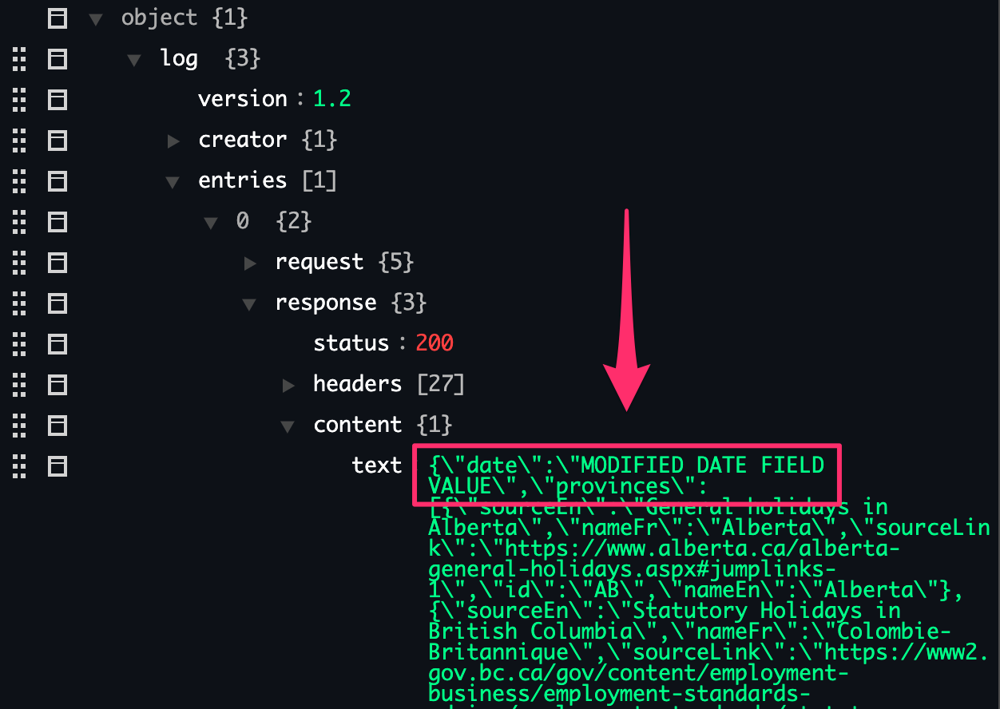

[_Return to Tutorials Overview_](../README.md)

# Response Logger Injections

### Overview

For use cases where the mock response files / data needs to be modified in some way before the mock is generated, we can leverage response loggers.
Response logger injections are **ONLY** used to modify the mock data written to file, not the data that is used in response / thin models.

### Topics Covered
1. [Example use case](#example-use-case)
2. [Modifying response data](#modifying-response-data)

### References
- [ResponseLoggerInjector](../../NST/src/main/java/com/ebay/service/logger/injection/ResponseLoggerInjector.java)

## Example use case

Response logger injections are used when we would want to modify the mock response data **AFTER** it has been used to validate some data (e.g. in a thin model), but **BEFORE** the mock is generated.

An example use case for response logger injections could be when iOS or Android applications need to complete some external/third-party (web) flow to proceed in the iOS / Android app flow. The native iOS / Android app would be handed back control once the web flow is completed (via some redirect webhook). So our use case is:
- Initial URL to load the webview is provided to native iOS / Android app in service response
- Native iOS / Android app that requires external web flow to be completed to continue in native app flow
- Control is handed back to native iOS / Android app once web flow is completed, via some redirect / webhook

In this scenario, we would **not** want our mock data to be generated with the actual web URL, since using the mock in this format would cause our UI test automation to load an actual URL, which would likely not be valid. Instead, we can utilize response logger injections to **replace** the web URL in the service response with the redirect / webhook that would trigger the native app to load the "next step" in a given flow.
So, instead of the field in the mock that is generated with NST having a real URL, it would instead have a URI or redirect link that would trigger the completion or closing of that webview, in order for the UI test to continue execution.

## Modifying response data

Response logger injections are utilized at the service wrapper level. Service wrappers have a method, `getResponseLoggerInjector`, that requires an implementation of *`ResponseLoggerInjector`.* 

*`ResponseLoggerInjector`* only has 1 method, `processServiceResponse` , which is where we will be making our modifications to the response data. 

Here is an example implementation of the `ResponseLoggerInjector`'s `processServiceResponse` method, which modifies the `$.holiday.date.holiday` field to a different value:

```java
@Override
public String processServiceResponse(String rawServiceResponsePayload) {

    // Change the holiday date field to "MODIFIED DATE FIELD VALUE"
    // Path: $.holiday.date

    JSONObject holiday = new JSONObject(rawServiceResponsePayload).getJSONObject("holiday");
    holiday.put("date", "MODIFIED DATE FIELD VALUE");

    return holiday.toString();
}
```

After we’ve created our *`ResponseLoggerInjector` ,* we just need to set it in the service wrapper class in `getResponseLoggerInjector`. Now, whenever this service wrapper is sent, the generated mock response file will have the specified field values “injected” into it.

To see this functionality in action, run the `exampleResponseLoggerInjectionMockGenerationTest` test in [`ResponseLoggerInjectionsTest.java`](src/test/java/com/ebay/nst/tutorials/rest/responseloggerinjections/ResponseLoggerInjectionsTest.java).

After running the example test method, you can inspect the generated HAR file to see how the response block was modified:
