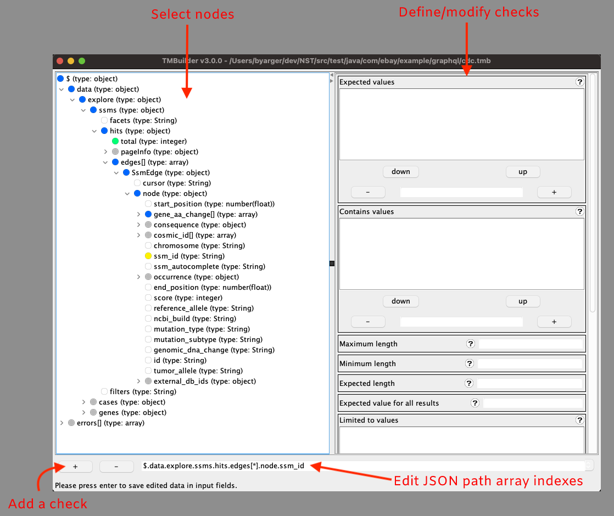

# TMBuilder
Thin Model Builder (TMBuilder) is a UI tool for defining and generating NST thin model checks and developer mocks. It consumes OpenAPI yaml, JSON schema or GraphQL schema and allows you to visually specify the thin model validations you would like to perform and mock values you would like to use in your developer mocks. Thin model validations and developer mocks can be exported to your java classes, or json respectively, for use in your test automation.  

## Executable

Executable requires Java 8 or later. Download is available under [releases](https://github.com/eBay/NSTSuite/releases).

## Build & Run Locally

**Maven Build Command**:
`mvn clean install exec:java -Dexec.cleanupDaemonThreads=false -Dexec.mainClass=com.ebay.tool.thinmodelgen.TMBuilder`  

**Launch Command - If Already Built**:
`mvn exec:java -Dexec.cleanupDaemonThreads=false -Dexec.mainClass=com.ebay.tool.thinmodelgen.TMBuilder`  

**Launch Command - with verbose output flag set**:  
`mvn exec:java -Dexec.cleanupDaemonThreads=false -Dexec.mainClass=com.ebay.tool.thinmodelgen.TMBuilder -Dexec.args="-v"`

## Release Notes

**Release version**  

  
Click to expand!

  
| Version  | Notes  |
|---|---|
| 3.0.0 | Introducing developer mock generation. Read the section on developer mocks for more information. |
| 2.0.2 | GraphQL schema processing bug fixes - multiple schema file support and reference type name presentation. If a type definition is missing from the schemas a pop-up message is displayed to the user. |
| 2.0.1 | Correct GraphQL parsing bug that dropped the operation name from the schema tree. |
| 2.0.0 | Adding GraphQL Support. TMB internal file pathing is no longer relative to the TMBuilder executable. Pathing to the schema and export file location is now relative to the TMB file. To update you existing files, place the TMBuilder executable in the same location as your existing TMBuilder executable, open each of your TMB files and then save them. After saving each of your TMB files with the 2.0.0 TMBuilder you are free to move your TMBuilder executable anywhere you like on your file system. |
| 1.0.8 | Fix for array parsing of primitive items. |
| 1.0.7 | Fix parsing error related to JSON schema with arrays without defined items. |
| 1.0.6 | Patch for JPJsonObjectCheck output not wrapping output in quotes. |
| 1.0.5 | Support for oneOf/anyOf response model schemas. |
| 1.0.4 | JPObjectCheck support code generation for defined checks and added negative contains check for object fields. |
| 1.0.3 | Fix import statement generation to choose the wrapped JP*Check. |
| 1.0.2 | Fix duplicate field entry issue. |
| 1.0.1 | Fix for issue reported when parsing strings that are DateTime instances. Significant improvement to OpenAPI parsing time. Recent files will only track .tmb files. |
| 1.0.0 | Support for OpenAPI schema |

## Thin Models
Thin models are model classes supported by JSON path expressions for retrieving leaf node values. Instead of a full POJO structure requiring lengthy dot notation to retreive nested properties, JSON path allows for retrieval of a node or set of nodes to perform an verification of data correctness. This is the second order contract testing check performed where the data of the response is evaluated for correctness as defined in the thin model checks. Once you've defined all of your checks you may export the tests to your check class and the TMBuilder will generate the code for each check you've defined in the TMBuilder.

The TMBuilder leverages the service schema and visually renders it in a tree structure. The user selects the node(s) where a check is needed and a type specific set of check options are shown based on the node selected. The type checks differ based on the node being part of a list (the JSON path includes an array).

Start by selecting a node from the tree and pressing the '+' button to add a check. You may add more than one path per node so long as the path includes an array and is unique for each check. This means changing the array index from a wildcard '*' to an explicit value (EG: [ * ] to [1]). You may then add another path to the same node by pressing the '+' button again. The default path will always be a wildcard path. It is NOT possible to add multiple paths for nodes that do not include an array in the JSON path. Paths may be changed by clicking the combo box drop down or removed by pressing the '-' button.

You may define different Validation Sets for organizing your verifications into groupings. There will always be a core set of validations (Core Validation) that applies to all responses and is evaluated with every thin model instance. Your custom validation sets may be leveraged in your tests as dictated by the test case.

You may preview the checks that will be generated from the Validation Sets > Review Check menu option.

Once you've defined all of the checks you need, select File > Export TM Checks and select the Java class you would like to export the checks to. Please see our [thin model tutorial](https://github.com/eBay/NSTSuite/tree/main/NSTTutorials/ThinModels) for more information about thin model classes and using thin models in tests.

## Developer Mocks
When defining checks you will see a cell for mock value(s). A default mock value is supplied with each check. This allows you to export developer mocks. Developer mocks enable parallel development while waiting on your service implementation with the benefit of being able to verify your developer mock later in NST tests by using thin model checks. For paths with arrays and wildcards '*' each wildcard defaults to an array of length 1 and index 0. The mock values in this case allow for n number of mock values and the final array will be set to the same size as there are mock values defined. If you change all of the array indexes to distinct values the mock will only support a single value. Single values will take precidence over wildcard array values so you need not be concerned about specific values being overwritten. Wildcard mock values may be overwritten however by single mock values.

Mock JSON may be viewed by selecting the Validation Set > Review Mock menu option.

You may export your JSON mocks to file by selecting File > Export Developer Mocks and selecting the output directory. Each custom validaiton set will produce a JSON file following the naming convention `TMMock_<Validation Set Name>.json`.

## Running on Mac OS  
If you are running Mac OS, file access permission will be an issue. Executable jars (jars that can be run by double clicking on the jar) are launched by JavaLauncher. It is the JavaLauncher that you need to give file access permissions to.

Open your System Properties and then open Security & Privacy. Select the Privacy tab. Unlock to make changes, then select Full Disk Access. Press the + button to add an application and navigate to `/System/Library/CoreServices` and select JavaLauncher and press open to close the file chooser dialog. Make sure JavaLauncher is shown in the list of approved applications and it has a check by it. Lock the settings and double click on the executable jar. You now have access to all of your files and folders using the file chooser in the app!

If you are running the jar from the command line using 'java -jar' then you would do the same series of steps but add the java executable for each of your installed jdk/jre versions. The path would be `/Library/Java/JavaVirtualMachines` then the java version and then navigate to the bin folder and select java to add it to the list.
